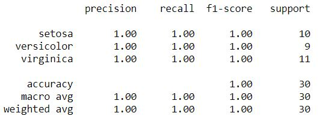

# Iris-Classification  
This repo contains the famous Iris Image Classification which gives 100% Accuracy, Precision, Recall and F1 score on Test Data.  

## Datasets 
Dataset is already available inside the seaborn library. You can load the data using `seaborn.load_dataset('iris')`. Read more about the Datasets [here](https://www.kaggle.com/uciml/iris)  

### Data Splitting
I have split the dataset into train and test in 80% and 20% respectively.  

## Model Architecture
I have used `Random Forest Classifier` with **`n_estimators = 1500`** and **`max_depth = 5`**.   

## Results and Evaluation

### Classification Report
Classfiction Report for this project is as follows: 

